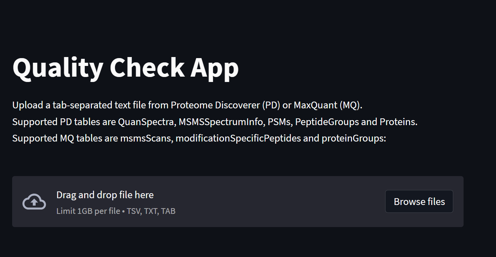
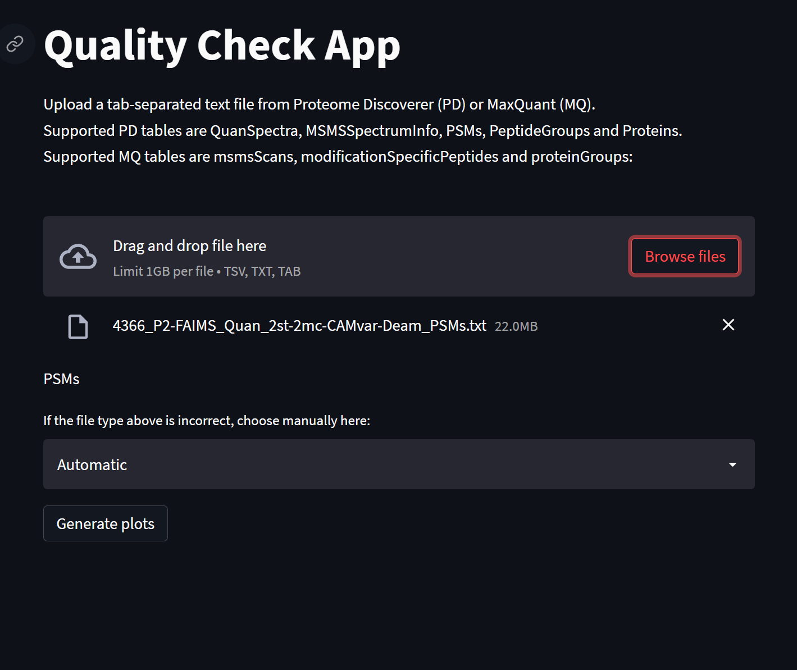

# protexam
## Inspect your quantitative proteomics results using this streamlit-powered dashboard. The dashboard is specifically tailored for the comprehensive examination of the result of isobaric labeling-based quantitative proteomics.

*protexam* has been tested on Python 3.8 on Windows 10 and Ubuntu 20.04.
The package is dependent on multiple packages, such as *streamlit*, *bokeh*, *matplotlib*. Because of that, we strongly advise creating a virtual environment. One option is [*venv*](https://packaging.python.org/en/latest/guides/installing-using-pip-and-virtual-environments), which is a part of Python's standard library. First, we need to choose a path and create a virtual environment there. On Linux, create the environment using the command line, with your custom path and project name:


```
python3 -m venv /your_project_path/project_name
```

Now we can activate the newly created environment:

```
source /your_project_path/project_name/bin/activate
```

If the environment has been activated correctly, the name of the environment should be displayed in the console.

```
(project_name) user:~$
```

It is a good idea to update pip within the virtual environment before installing other packages:

```
pip3 install --upgrade pip
```

We can now install *protexam*:

```
pip3 install protexam
```

The dashboard is based on *streamlit*, so we will need to run the script *app.py* in order to deploy the dashboard. The module will help us to find the path to the *app.py* file. Run the module as follows:

```
python3 -m protexam
```

The output in the console will contain a few notes, including the path to the source file. Change the working directory using the suggested path:

```
cd /path_to_app_source
```

Finally, run the *streamlit* app:

```
streamlit run app.py --server.maxUploadSize 1000 --server.port 8501
```

where:
    server.maxUploadSize - max size of a single text file in MB
    server.port - port for the app

On the start of the application, *streamlit* will give us a hint on how to access the dashboard in a web browser. To view locally, go to:
```
http://localhost:8501
```

Use the IP address to view the dashboard in the local network:
```
http://ip-of-the-server:8501
```
If the app is running correctly, we will see the file upload widget:



The dashboard has been specifically adapted for the [Proteome Discoverer (PD)](https://www.thermofisher.com/se/en/home/industrial/mass-spectrometry/liquid-chromatography-mass-spectrometry-lc-ms/lc-ms-software/multi-omics-data-analysis/proteome-discoverer-software.html) tab-delimited output files. However, a few of the MaxQuant tables are also supported. There are two options for creating tab-delimited text output in PD 2.4:
* add the Result Exporter node to tconsensus workflow. We usually choose "True" for the "R-Friendly header" option, but the app works with "False" as well. The resulting text files can be found in the study folder.
* if the workflows have been already completed, open the PD result file and go to the menu File -> Export -> To Text (tab delimited).

The files are uploaded and visualized one-by-one. Choose one of the permitted tables and upload. The app will try to determine the type of the uploaded file and show it below the upload widget. If the type has been inferred correctly, press the "Generate Plots" button. If you know the type of the table, but it has not been determined automatically, you can override it manually by selecting from the list, an then pressing the "Generate Plots" button.


